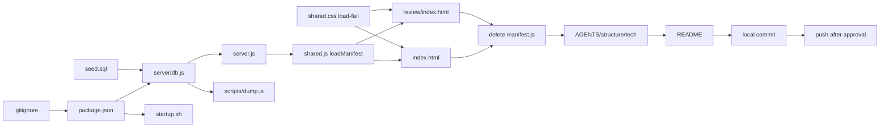

# Node.js + SQLite 内容迁移 — 任务清单

> 配套：
> - 需求 `spec-workflow/specs/nodejs-sqlite-migration/requirements.md`
> - 设计 `spec-workflow/specs/nodejs-sqlite-migration/design.md`
> - 约定 `spec-workflow/steering/conventions/colors.md`、`AGENTS.md`

## 总览

按 design §10 顺序分 5 个阶段拆 16 个原子任务。每个任务标注它修改/新建的文件、对应 design 章节、完成判定（手测从 design §9 smoke list 摘相关项）。**严格按序号执行**，跨阶段顺序有依赖（详见每个 task 的 *前置* 字段）。**最后 push 步骤必须等用户明确指令**。

---

## 阶段 A · 后端基础（任务 1–7）

### - [ ] 1. 追加 .gitignore 排除 node_modules 和运行时 SQLite

- **范围**: 修改 `.gitignore`
- **对应 design**: §6.2
- **前置**: 无
- **步骤**:
  - 在现有 `.gitignore`（已有 `.claude/...` 两行）追加：
    ```
    # Node
    node_modules/
    npm-debug.log*

    # Runtime SQLite (rebuild from data/seed.sql on boot)
    data/star.db
    data/star.db-journal
    data/star.db-wal
    data/star.db-shm
    ```
- **完成判定**: `git status` 显示 `.gitignore` modified；将来生成 `data/star.db` 后 `git status` 不会列出它。
- **Req refs**: §依赖与集成、§数据库

---

### - [ ] 2. 新建 package.json

- **范围**: 新建 `package.json`
- **对应 design**: §4.1
- **前置**: task 1
- **步骤**: 完整粘贴 design §4.1 的 JSON，确认 `engines.node >= 22`、scripts `start` / `dump` 都带 `--experimental-sqlite`、唯一运行时依赖 `express ^4.19.0`。
- **完成判定**: `node -e "JSON.parse(require('fs').readFileSync('package.json'))"` 不报错；`npm install --no-audit --no-fund` 成功生成 `node_modules/express` 和 `package-lock.json`。
- **Req refs**: §后端、§启动 / 部署

---

### - [ ] 3. 新建 data/seed.sql（schema + 当前 manifest 数据）

- **范围**: 新建 `data/seed.sql`
- **对应 design**: §4.4
- **前置**: 无（与 task 2 可并行）
- **步骤**: 完整粘贴 design §4.4 的 SQL。逐字段对比 `js/manifest.js`：
  - book: id=`book1`, title=`Book 1 · 课本一`
  - u3: number=`U3`, title=`Unit 3`, card_count=32, blank_count=180
  - u6: number=`U6`, title=`Unit 6 · Famous people in history`, card_count=33, blank_count=192
  - 注意中间点是 `·`（U+00B7），不是 `.`
- **完成判定**: 文件存在；用 `sqlite3 :memory: < data/seed.sql && echo OK` 验证可执行（macOS 自带 sqlite3）。
- **Req refs**: §数据库、§数据模型

---

### - [ ] 4. 新建 server/db.js（DB 查询封装）

- **范围**: 新建 `server/db.js`、新建目录 `server/`
- **对应 design**: §4.3
- **前置**: task 2、task 3
- **步骤**: 完整实现 design §4.3 的代码。检查清单：
  - `module-level` 缓存 `dbInstance` / `stmtListBooks` / `stmtListUnits`
  - `ensureDb` 检查 db 文件存在性，缺失时从 seed.sql 重建（fs.existsSync 判断、fs.mkdirSync 递归建目录、DatabaseSync.exec(sql)）
  - `getManifest` 把 `card_count`/`blank_count` 转 camelCase
  - 排序 SQL 严格按 `ORDER BY sort_order, id` 和 `ORDER BY book_id, sort_order, slug`
  - WHERE `enabled = 1`
  - `PRAGMA foreign_keys = ON`
  - 导出 `ensureDb / listBooksEnabled / listUnitsEnabled / getManifest`
- **完成判定**: `node --experimental-sqlite -e "var db=require('./server/db'); db.ensureDb({dbPath:'data/star.db',seedPath:'data/seed.sql'}); console.log(JSON.stringify(db.getManifest(), null, 2))"` 输出和 `js/manifest.js` 的 `MYSTAR_MANIFEST` 结构完全一致（books → units，cardCount/blankCount camelCase）。
- **Req refs**: §DB 查询封装

---

### - [ ] 5. 新建 server.js（Express 入口）

- **范围**: 新建 `server.js`
- **对应 design**: §4.2
- **前置**: task 4
- **步骤**: 完整实现 design §4.2 的代码。检查清单：
  - 启动前先调 `db.ensureDb({...})`
  - **deny middleware**：在 `/api/manifest` 路由之前注册一个 `app.use((req,res,next)=>...)`，拦截 `/data/*`、`/server/*`、`/scripts/*`、`/node_modules/*`、`/package.json`、`/package-lock.json`、`/.gitignore`、`/.git/*`、`/.claude/*` 等敏感路径，返回 404。**这一步关键**：否则 `express.static(ROOT)` 会把 `data/star.db` / `server/db.js` / `package.json` 等都暴露给 LAN
  - 先注册 deny middleware → `/api/manifest` → `express.static(ROOT, {extensions:['html']})`
  - `/api/manifest` 路由有 try/catch，500 时返回 `{error}`
  - 响应头 `Cache-Control: no-cache, must-revalidate`
  - 静态资源 HTML/JS/CSS 也设 `no-cache`（dev 友好）
  - `app.listen(PORT, HOST=0.0.0.0, ...)`，PORT 来自 env 默认 8000
- **完成判定**:
  - `npm start` 启动成功
  - `curl -s http://localhost:8000/api/manifest | python3 -m json.tool` 输出和 `js/manifest.js` 的 MYSTAR_MANIFEST 一字不差
  - `curl -s http://localhost:8000/index.html | head -1` 返回 `<!DOCTYPE html>`
  - **safety**：`curl -o /dev/null -w "%{http_code}\n" http://localhost:8000/data/star.db` 返回 `404`，同样 `/server/db.js`、`/package.json` 也都是 `404`
- **Req refs**: §后端、§API

---

### - [ ] 6. 新建 scripts/dump.js（npm run dump 实现）

- **范围**: 新建 `scripts/dump.js`、新建目录 `scripts/`
- **对应 design**: §4.5
- **前置**: task 4
- **步骤**: 完整实现 design §4.5 的代码。重点核对：
  - SQL `ORDER BY` 子句严格按 design 写
  - `sqlStr()` 单引号转义（`'` → `''`）
  - 输出末尾用 `out.join('\n')`（不加额外尾换行）
  - 表 schema 行的格式跟 task 3 seed.sql 一字不差（包括缩进、空格）
- **完成判定**: 跑 `npm run dump` 两次（不动 db）；`shasum -a 256 data/seed.sql` 两次结果一致（macOS 默认带 shasum；不要用 md5sum，macOS 没有）；`git diff data/seed.sql` 显示**无变化**（如果之前提交过同一份内容）。
- **Req refs**: §数据库（npm run dump 子项）

---

### - [ ] 7. 改写 startup.sh

- **范围**: 修改 `startup.sh`
- **对应 design**: §6.1
- **前置**: task 2
- **步骤**: 用 design §6.1 的 bash 草案完整替换现有内容。检查：
  - Node 版本检查（>= 22）失败时非零退出
  - 依赖触发条件**三选一**：`[ ! -d node_modules ]` 或 `[ package.json -nt node_modules ]` 或 `[ package-lock.json -nt node_modules ]`（覆盖 git pull 后 lock 变了但 package.json 没变的场景）
  - `trap cleanup EXIT INT TERM HUP`
  - **直接 `node --experimental-sqlite server.js &`，不要 `npm start &`**：避免 PID 只是 npm wrapper、kill 杀不到 Express 子进程导致端口残留。`npm start` 仍保留在 package.json 给手动 dev 调用
- **完成判定**:
  - 文件 mode 仍是可执行（`ls -l startup.sh` 含 x）
  - 删 `node_modules` 后跑 `./startup.sh` 看到 "Installing dependencies..." 然后 server 起来；浏览器开 http://localhost:8000 看到首页
  - **信号转发验证**：跑 `./startup.sh`，Ctrl+C 后 `lsof -i :8000` 必须无残留进程（如果 npm 没正确转发，会有 orphan node 进程）
  - **lock 触发验证**：`touch package-lock.json` 把它时间戳推到比 node_modules 新，再跑 `./startup.sh` 必须看到 "Installing dependencies..."
- **Req refs**: §启动 / 部署

---

## 阶段 B · 前端加载层（任务 8–11）

### - [ ] 8. 在 js/shared.js 追加 MyStar.loadManifest

- **范围**: 修改 `js/shared.js`
- **对应 design**: §5.1
- **前置**: task 5（API 必须能 work，否则没法验证）
- **步骤**: 在 IIFE 内、`W.MyStar = {...}` 导出对象之前添加 `loadManifest(callback)` 函数；按 design §5.1 严格 ES5（`var`/`function`/`XMLHttpRequest`，无 const/let/arrow/Promise/fetch）；`xhr.timeout = 10000`、`ontimeout` / `onerror` / 状态判断逻辑都齐全；最后把 `loadManifest: loadManifest` 加进导出对象。
- **完成判定**:
  - 浏览器 DevTools console 跑 `MyStar.loadManifest(function(e,d){console.log(e,d)})` 看到 `null, {books:[...]}`
  - 跑 `curl -I http://localhost:8000/api/manifest`，header 含 `Cache-Control: no-cache`
  - grep 文件确认无 `const|let|=>|fetch|Promise` 新增
- **Req refs**: §前端

---

### - [ ] 9. 在 style/shared.css 追加 .load-fail 样式

- **范围**: 修改 `style/shared.css`
- **对应 design**: §5.4
- **前置**: 无（与 task 8 可并行）
- **步骤**: 在 shared.css 末尾追加 design §5.4 的 CSS 块。要点：颜色全部 `var(--accent-amber-soft)` / `var(--ink)` / `var(--accent-amber)`，box-shadow 用 `var(--shadow-md)`，圆角 `var(--radius-lg)`；**禁止新增任何硬编码 hex**。
- **完成判定**: `grep -E '#[0-9a-fA-F]{3,6}' style/shared.css | wc -l` 数字相比改前没增加；新增的 `.load-fail` 块在浏览器里手动加 `<div class="load-fail"><div class="lf-msg">test</div><button class="btn-pill primary">test</button></div>` 后样式正确（amber-soft 底、navy ink 描边、偏移阴影）。
- **Req refs**: §界面与交互规范

---

### - [ ] 10. 改写 index.html 入口为异步加载

- **范围**: 修改 `index.html`
- **对应 design**: §5.2
- **前置**: task 8、task 9
- **步骤**:
  - 删 `<script src="js/manifest.js"></script>` 这一行
  - `var manifest = window.MYSTAR_MANIFEST;` 改为 `var manifest = null;`
  - 新增 `showLoading()` / `showError()` 两个函数（DOM 操作按 design §5.2）
  - `boot()` 改为：`M.recordActiveDay()` → `showLoading()` → `M.loadManifest(function(err, data) { ... })`
  - `showError` 的"重试"按钮**必须**用 `M.addTapListener` 绑定（按 requirement #1 actionable fix）
  - 其他 render 函数闭包引用 `manifest` 变量，赋值后自然可用 — 不动
- **完成判定**:
  - 刷新首页正常渲染（guide row、推荐卡、unit 列表）
  - DevTools Network 切 Offline → 刷新 → 显示加载失败面板 + 重试按钮 → 切回 Online 点重试 → 正常恢复
  - 手动检查重试按钮 tap 反馈正常（用 `MyStar.addTapListener` 触发的 scale 反馈）
- **Req refs**: §前端

---

### - [ ] 11. 改写 review/index.html 入口为异步加载

- **范围**: 修改 `review/index.html`
- **对应 design**: §5.3
- **前置**: task 8、task 9
- **步骤**:
  - 删 `<script src="../js/manifest.js"></script>` 这一行
  - `var manifest = window.MYSTAR_MANIFEST;` 改为 `var manifest = null;`
  - **新增 review 版 `showError()`**（按 design §5.3 完整草案）：渲染 `.load-fail` 面板到 `#review-content` 容器，文案 `内容加载失败，检查服务后重试`；**重试按钮必须用 `M.addTapListener` 绑定**（按 requirements actionable fix #1），点击触发 `bootReview()`
  - **新增 `bootReview()`**：包裹原 DOMContentLoaded 内容；外层调 `M.loadManifest(function(err, data){...})`：失败 → `showError()`；成功 → `manifest = data` 后跑原 `forEach + Promise.all + render`
  - DOMContentLoaded 监听器改为 `document.addEventListener('DOMContentLoaded', bootReview)`
  - **不动**原有的 `forEach` / `Promise.all` / arrow function（明确在本期 out-of-scope，requirement 假设 #4）
- **完成判定**:
  - 刷新 `/review/` 重点集页正常加载星标卡片
  - DevTools Offline → 刷新 → 显示 `.load-fail` 面板 + 重试按钮 → 切回 Online 点重试 → 正常恢复（验证 `bootReview` 重入逻辑）
  - 重试按钮 tap 反馈正常（验证 `M.addTapListener` 绑定，而非 raw onclick）
- **Req refs**: §前端

---

## 阶段 C · 清理（任务 12）

### - [ ] 12. 删除 js/manifest.js

- **范围**: 删除 `js/manifest.js`
- **对应 design**: §10 step 9
- **前置**: task 10、task 11（前端入口已经不依赖它，且都验证过）
- **步骤**:
  - `git rm js/manifest.js`
  - `grep -r "manifest.js" --include="*.html" .` 应只有可能在 spec 文档里的引用、无 HTML 引用
- **完成判定**:
  - 文件已删
  - 刷新首页和 review 仍正常工作（API 路径已生效）
  - DevTools Network 没再请求 `manifest.js`
- **Req refs**: §前端（`manifest.js` 删除）、§不在范围内（保险：确认 fallback 这条不存在）

---

## 阶段 D · 文档同步（任务 13–14）

### - [ ] 13. 更新 AGENTS.md + steering/structure.md + steering/tech.md

- **范围**: 修改 `AGENTS.md`、`spec-workflow/steering/structure.md`、`spec-workflow/steering/tech.md`（3 files）
- **对应 design**: §10 step 13
- **前置**: task 12
- **步骤**:
  - `AGENTS.md`：
    - 把 "What this is" 段里 "**no package.json**" 那句删掉，改为「Node 22+ 进程托管 Express + 浏览器端继续纯 ES5；**仅引入 express 这一个运行时依赖**，no bundler、no framework、no transpiler」
    - 新增一节「Data / DB」：简述 `data/seed.sql` 是 source of truth、`data/star.db` 是 gitignored 运行时副本、改完后必须 `npm run dump` 同步、grep server 侧不能含任何 user-state key
    - 「Run locally」段把 `./startup.sh` 命令保留，加一行：首次启动会 `npm install` + 自动从 seed 重建 `data/star.db`
  - `spec-workflow/steering/structure.md`：在「Directory layout」追加：
    - `server/`：Node 后端代码（db.js 等）
    - `data/`：seed.sql（入 git）和 star.db（gitignored）
    - `scripts/`：维护脚本如 dump.js
    - `node_modules/`、`package.json`、`package-lock.json` 在 repo 根
    - 在「Anti-patterns」追加：❌ server 侧读写任何 `starredCards_*` / `lastVisit_*` / `quizScore_*` / `mystar_active_days`
  - `spec-workflow/steering/tech.md`：
    - 「Stack」段把「Python `http.server`」整段替换为「Node.js 22+ + Express 4.x + 原生 `node:sqlite`（`--experimental-sqlite`），单进程同时 serve 静态 + `/api/manifest`」
    - 「Architectural decisions」追加一段「内容 vs 运行时数据」：内容（books / units）在 SQLite；用户运行时状态（quiz/star/streak）100% localStorage，server 不碰
- **完成判定**: 三个文件 git diff 都有具体的句子改动；grep `python.*http.server` 在 steering / AGENTS.md 应 0 命中；grep `package.json` 在 AGENTS.md 含正面提及。
- **Req refs**: §不在范围内之外的所有「文档同步」隐性需求

---

### - [ ] 14. 更新 README.md

- **范围**: 修改 `README.md`
- **对应 design**: §10 step 13
- **前置**: task 13
- **步骤**: 在 `# star-app` 标题下追加：
  ```markdown
  ## Run locally

  Requires **Node.js ≥ 22**.

  \`\`\`bash
  ./startup.sh
  \`\`\`

  First run installs dependencies (`express` only) and rebuilds `data/star.db` from `data/seed.sql`. Then open http://localhost:8000.

  ## Editing content

  Content (books / units) lives in `data/star.db`. To change:

  1. Open `data/star.db` with `sqlite3` CLI or DB Browser.
  2. INSERT / UPDATE / DELETE.
  3. Refresh the browser (API is `no-cache`).
  4. Run `npm run dump` to sync changes back to `data/seed.sql`.
  5. Commit `data/seed.sql`.

  User progress (quiz scores, starred cards, streak) stays in browser `localStorage` and is never read by the server.
  ```
- **完成判定**: `cat README.md | head -30` 显示新内容；命令块语法正确（fence 闭合）。
- **Req refs**: 文档同步

---

## 阶段 E · 提交（任务 15–16）

### - [ ] 15. Local commit

- **范围**: git 操作（无文件改动）
- **对应 design**: §10 step 14
- **前置**: task 1–14 全部完成 + iPad LAN 实测通过 + fresh-checkout 测试通过（这两项属于 design §10 step 11/12，建议在本 task 之前手工跑一遍）
- **步骤**:
  - `git status` 确认改动列表。预期 commit 范围（执行者要核对）：
    - **新增**：`package.json`、`package-lock.json`、`server.js`、`server/db.js`、`data/seed.sql`、`scripts/dump.js`
    - **修改**：`.gitignore`、`startup.sh`、`js/shared.js`、`style/shared.css`、`index.html`、`review/index.html`、`AGENTS.md`、`README.md`、`spec-workflow/steering/structure.md`、`spec-workflow/steering/tech.md`
    - **删除**：`js/manifest.js`
    - **本 spec 流程产物（一并入 git）**：`spec-workflow/specs/nodejs-sqlite-migration/requirements.md`、`design.md`、`tasks.md` —— 这三个文件在本次 spec 流程中创建/迭代，属于 working tree 的 untracked 内容，需要纳入 commit
  - `git add` 上述具体文件（**不要** `git add .`，避免误带 `data/star.db` 或其它无关文件）
  - `git commit -m "..."` 用 multi-line message 简述：从 python http.server 迁移到 Express + node:sqlite，SQLite 装内容元数据，前端继续 ES5 + XHR，用户状态依然 localStorage；Co-Authored-By 签名按规则带上
- **完成判定**:
  - `git log -1 --stat` 显示新 commit + 文件列表（含本 spec 三个 md 文档）
  - `git status` 输出 `nothing to commit, working tree clean`（除非 `data/star.db` 等 gitignored 文件存在但被正确忽略）
  - 本地分支 `main` 比 `origin/main` 领先 1 个 commit（`git status` 提示「Your branch is ahead of 'origin/main' by 1 commit」）
- **Req refs**: §依赖与集成

---

### - [ ] 16. Push（等用户批准）

- **范围**: git push（无文件改动）
- **对应 design**: §10 step 15
- **前置**: task 15 完成
- **步骤**:
  - 把 `git log -1 --stat` 输出给用户看
  - **明确询问用户是否 push**；executor 不得擅自 push
  - 用户回复 "push" / "yes" 等明确指令后才跑 `git push`
  - 用户若说 "暂不 push" / "我再 review 一下"，则此 task 标记为待续，等下次指令
- **完成判定**:
  - `git push` 输出显示 `main -> main` fast-forward 成功
  - `git status` 显示 "Your branch is up to date with 'origin/main'"
- **Req refs**: §依赖与集成

---

## 任务依赖图（mermaid）



## 不在任务范围内（重要排除）

- 写 unit test（本期不上 test 框架）
- 给 `review/index.html` 内部 fetch+Promise+arrow 做 ES5 重构（requirement 假设 #4 明确 out-of-scope）
- 加 pre-commit hook 防 .db 比 .sql 新（design §11 风险段有提，但延后）
- 加 admin Web UI
- Unit 卡片内容入库
- 用户体系、登录、上云、HTTPS
