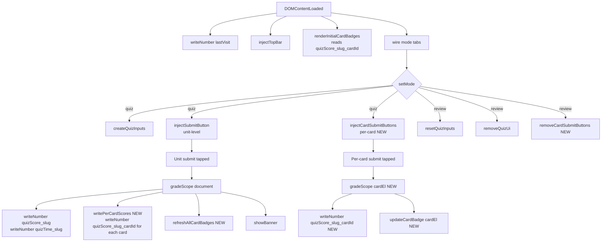

# Design Document

## Overview

Per-card quiz submit extends the existing two-mode unit page (review / quiz) with **card-scoped grading** alongside the existing unit-scoped grading. All new behavior is layered onto `js/unit-enhance.js` (the IIFE that already injects the mode tab, quiz inputs, and the bottom submit button) plus a small CSS addition in `style/unit-enhance.css`. No changes to `index.html`, `review/index.html`, `js/shared.js`, `js/manifest.js`, or the per-unit HTML files.

The design is deliberately narrow:

- The data shape is one extra `localStorage` key per `(unit, card)` pair: `quizScore_<slug>_<cardId>`. The aggregate `quizScore_<slug>` keeps its existing meaning.
- The DOM additions are: (a) a `.quiz-card-submit-wrap` block appended to each `.vocab-card` that has `.blank` children, (b) a `.card-score-badge` span inserted into each card's `.card-actions`.
- The grading function is generalised from "grade all `.quiz-input`" to "grade `.quiz-input` within a scope element"; the existing `gradeQuiz()` becomes a thin wrapper that passes `document`.

## Steering Document Alignment

### Technical Standards (tech.md)

- **ES5 only.** All new code uses `var`, `function`, ES5 array iteration via `Array.prototype.forEach` (already in use in the file). No `const/let`, arrow, template literal, `Promise`, or ES module syntax.
- **Storage through MyStar.** New key `quizScore_<slug>_<cardId>` is written exclusively via `MyStar.writeNumber` and read via `MyStar.readNumber`. No raw `localStorage` calls. Cookie double-write is not added for these keys (they are derivable from per-card submits and the unit aggregate already double-writes via the existing flow — keeps cookie under the 4KB budget called out in `tech.md`).
- **Tap interactions.** New per-card submit button is wired with `MyStar.addTapListener` for iPad Safari touchend/click dedup. No `onclick=` attributes, no raw `addEventListener('click', …)`.
- **No dependencies, no build.** Pure additions to the existing IIFE. Refresh-to-see-change.
- **Lenient answer matching.** Reuses `MyStar.isAnswerCorrect` — no new normalization path.

### Project Structure (structure.md)

- New storage key follows the documented `_<slug>` suffix convention, extended once more: `quizScore_<slug>_<cardId>`. The `_<cardId>` segment is appended after `_<slug>`, preserving the homepage's existing prefix-match assumption (it looks up `quizScore_<slug>` directly, not by prefix).
- All JS lives in `js/unit-enhance.js` (per `structure.md`: "Shared behavior loaded by individual Unit pages").
- All CSS lives in `style/unit-enhance.css` ("Unit-page-only tweaks").
- No new global, no new top-level file. Stays within the `MyStar` namespace boundary.

### Conventions Compliance (conventions/colors.md)

- All new colors are existing tokens. No new hex.
- Badge color tiers map to existing tokens:
  - score ≥ 80 → `background: var(--accent-green-soft); color: var(--accent-green);`
  - 60 ≤ score < 80 → `background: var(--accent-amber-soft); color: var(--accent-amber);`
  - score < 60 → `background: var(--neutral-gray-soft); color: var(--text-secondary);`
- The per-card submit button reuses the existing `.quiz-submit` class with a `.quiz-submit--card` modifier for smaller padding only (no new color). This keeps the navy CTA convention intact.
- No new `border-left` decorations (per colors.md rule #8).

## Code Reuse Analysis

### Existing Components to Leverage

- **`MyStar.readNumber` / `MyStar.writeNumber`** (js/shared.js:28-38): used as-is for the new card-scoped scores. No extension needed.
- **`MyStar.isAnswerCorrect`** (js/shared.js:49): used as-is for per-card grading. Identical lenient rules across unit and card paths.
- **`MyStar.addTapListener`** (js/shared.js:60): used as-is for the per-card submit button.
- **`createQuizInputs` / `resetQuizInputs`** (js/unit-enhance.js:75, 95): unchanged — they already operate on all `.blank` / all `.quiz-input` document-wide, which is correct for both per-card and unit-level flows.
- **`gradeQuiz`** (js/unit-enhance.js:104): refactored into `gradeScope(scope)` taking a DOM element (default `document`); existing call sites keep working unchanged by virtue of a thin wrapper.
- **`.quiz-submit` CSS** (style/unit-enhance.css:122): reused via class composition (`class="quiz-submit quiz-submit--card"`).
- **`.quiz-input.correct` / `.quiz-input.wrong` / `.quiz-hint` CSS** (style/unit-enhance.css:92-114): reused as-is — per-card grading uses the exact same visual feedback.

### Integration Points

- **Existing `setMode('quiz')` path** (js/unit-enhance.js:148): one additional call inside this branch — `injectCardSubmitButtons()` — to add per-card buttons whenever the unit enters quiz mode.
- **Existing `setMode('review')` path** (js/unit-enhance.js:164): one additional call — `removeCardSubmitButtons()` — alongside the existing `removeQuizUi()`.
- **Existing unit-level submit handler** (js/unit-enhance.js:158-163): after `gradeQuiz()` returns, an additional `writePerCardScores()` pass walks each card and writes its score, then `refreshAllCardBadges()` updates header badges in place.
- **DOMContentLoaded handler** (js/unit-enhance.js:172): one additional call — `renderInitialCardBadges()` — to render badges for any card that already has a stored score (visible in both modes).
- **No external integration.** No new files, no homepage edits, no review-page edits, no manifest edits.

## Architecture

The unit page already has a single IIFE that drives quiz mode. The new functions slot into the existing lifecycle without restructuring it.



The IIFE's public-facing API stays empty (it sets nothing on `window`); these are private helpers inside the existing closure.

## Components and Interfaces

All components below live inside the existing IIFE in `js/unit-enhance.js`. None are exposed on `window`.

### Component 1 — `gradeScope(scopeEl)`

- **Purpose:** Grade all `.quiz-input` descendants of `scopeEl`. The single grading function used by both unit-level and per-card flows.
- **Interfaces:**
  - Input: `scopeEl` (Element). When called with `document`, behaves identically to today's `gradeQuiz()`.
  - Returns: `{ score: number, correct: number, total: number }`. `score = 0` when `total === 0`.
  - Side effects: mutates `.quiz-input.correct/.wrong` classes and `.quiz-hint` siblings within `scopeEl`. Does not touch inputs outside `scopeEl`.
- **Dependencies:** `MyStar.isAnswerCorrect`.
- **Reuses:** Replaces the body of the existing `gradeQuiz()` function. `gradeQuiz()` becomes `function gradeQuiz() { return gradeScope(document); }` so existing call sites stay working.

### Component 2 — `injectCardSubmitButtons()` / `removeCardSubmitButtons()`

- **Purpose:** Mount/unmount per-card submit buttons as quiz mode is entered/left.
- **Interfaces:**
  - `injectCardSubmitButtons()` — for each `.vocab-card[id]` that contains ≥1 `.blank`, ensure a child `.quiz-card-submit-wrap > button.quiz-submit.quiz-submit--card` exists as the last child of the card. Idempotent: if already present, no-op.
  - `removeCardSubmitButtons()` — remove every `.quiz-card-submit-wrap` in the document.
- **Dependencies:** `MyStar.addTapListener` (for wiring), `gradeScope`, `MyStar.writeNumber`, `updateCardBadge`.
- **Reuses:** `.quiz-submit` styling (existing). Wiring pattern mirrors the existing `injectSubmitButton()` at js/unit-enhance.js:56-65.
- **Behavior on tap:**
  ```text
  result = gradeScope(cardEl)
  if cardEl.id:
      MyStar.writeNumber('quizScore_' + SLUG + '_' + cardEl.id, result.score)
  updateCardBadge(cardEl, result.score)
  // No banner. No quizTime write. Other cards untouched.
  ```

### Component 3 — `renderInitialCardBadges()` / `updateCardBadge(cardEl, score)` / `refreshAllCardBadges()`

- **Purpose:** Manage the per-card "上次 N%" badge in the card header.
- **Interfaces:**
  - `renderInitialCardBadges()` — called once at `DOMContentLoaded`. For each `.vocab-card[id]`, read `quizScore_<slug>_<cardId>`; if not null, call `updateCardBadge(cardEl, score)`.
  - `updateCardBadge(cardEl, score)` — ensure a `.card-score-badge` exists inside `cardEl .card-actions`, prepended before the existing buttons. Set its text to `'上次 ' + score + '%'` and its tier class (`tier-high` / `tier-mid` / `tier-low`).
  - `refreshAllCardBadges(byCard)` — called after a unit-level grade. Consumes the `byCard` map produced by the unit-level `gradeScope(document)` call (see Data Models below). For each entry, calls `updateCardBadge(document.getElementById(cardId), byCard[cardId].score)`. Does **not** re-grade.
- **Dependencies:** `MyStar.readNumber` (for `renderInitialCardBadges` only). No second `gradeScope` pass.
- **Reuses:** Existing `.card-actions` DOM structure (already present in every card in u3/u6). No new wrapper.
- **Visibility:** Badge has no mode-gated visibility — it is visible in both review and quiz mode (per requirements R4#2). The badge does not contain expected answers, so it is not a spoiler.

### Component 4 — `writePerCardScores(scoresByCardId)` (called from unit-level submit)

- **Purpose:** After a unit-level grade, persist per-card scores so badges and any future card-level features are consistent with the aggregate.
- **Interfaces:**
  - Input: `scoresByCardId` — `{ [cardId: string]: number }`, one entry per `.vocab-card[id]` that has ≥1 input.
  - Side effect: for each entry, `MyStar.writeNumber('quizScore_' + SLUG + '_' + cardId, score)`.
- **Single-pass grading:** the unit-level grade pass produces `byCard` (see Data Models). Both `writePerCardScores` and `refreshAllCardBadges` consume that map directly — no second `gradeScope` pass over individual cards.

### Component 5 — CSS additions in `style/unit-enhance.css`

- **Purpose:** Style the per-card submit button and the score badge using existing tokens.
- **Selectors / rules added:**
  - `.quiz-card-submit-wrap { display: flex; justify-content: flex-end; margin-top: 12px; }` (right-aligned, tight vertical rhythm to sit under the card's last row).
  - `body:not(.quiz-mode) .quiz-card-submit-wrap { display: none; }` (review mode hides the per-card submit just like the unit-level one).
  - `.quiz-submit.quiz-submit--card { padding: 8px 18px; font-size: 0.9rem; box-shadow: 0 4px 12px rgba(30, 95, 184, 0.18); }` (compact variant; same navy color via inherited rules).
  - `.card-score-badge { display: inline-block; padding: 2px 10px; border-radius: 999px; font-size: 0.78rem; font-weight: 600; margin-right: 8px; }`
  - `.card-score-badge.tier-high { background: var(--accent-green-soft); color: var(--accent-green); }`
  - `.card-score-badge.tier-mid  { background: var(--accent-amber-soft); color: var(--accent-amber); }`
  - `.card-score-badge.tier-low  { background: var(--neutral-gray-soft); color: var(--text-secondary); }`

## Data Models

### Storage keys (localStorage, via `MyStar.*`)

| Key | Type | Owner | Written by |
|-----|------|-------|------------|
| `quizScore_<slug>` | number (0–100) | unit aggregate | unit-level submit only (unchanged) |
| `quizTime_<slug>` | number (epoch ms) | unit aggregate | unit-level submit only (unchanged) |
| `lastVisit_<slug>` | number (epoch ms) | unit | DOMContentLoaded (unchanged) |
| `quizScore_<slug>_<cardId>` | number (0–100) | per card (NEW) | per-card submit AND unit-level submit |

Notes:
- `<cardId>` is `cardEl.id` verbatim (e.g. `vocab-card-1`). No client-side fallback id generation.
- No per-card timestamp key.
- No migration: legacy units without any per-card scores stay as-is until the next submit.

### `gradeScope` extended return

To let the unit-level handler reuse the same DOM walk for both the aggregate and the per-card persistence, `gradeScope` returns one extra optional field when called with `document`:

```text
gradeScope(scopeEl) -> {
    score:   number,        // 0–100, rounded
    correct: number,        // total correct inputs in scopeEl
    total:   number,        // total inputs in scopeEl
    byCard:  Object | null  // { cardId: { correct, total, score } }, set ONLY when scopeEl is document
}
```

`byCard` is keyed by the nearest ancestor `.vocab-card[id]` of each input. Inputs not under any `.vocab-card[id]` are excluded from `byCard` but still counted in the aggregate. This is the single source of truth for "what score does each card get from this submit" — no second grading pass needed.

### DOM additions (per card)

```html
<div class="vocab-card" id="vocab-card-N">
    <div class="card-header">
        <div class="vocab-title">…</div>
        <div class="card-actions">
            <!-- NEW: prepended by updateCardBadge when a score exists -->
            <span class="card-score-badge tier-high">上次 85%</span>
            <button class="btn-star">☆</button>
            <button class="btn-card-toggle">显示答案</button>
        </div>
    </div>
    <div class="content-group">…</div>
    <!-- NEW: appended by injectCardSubmitButtons in quiz mode -->
    <div class="quiz-card-submit-wrap">
        <button class="quiz-submit quiz-submit--card">提交本卡</button>
    </div>
</div>
```

## Error Handling

### Error Scenarios

1. **Card without an `id` attribute is encountered in quiz mode.**
   - **Handling:** Per Requirement 3 #2, no per-card submit button is injected for cards without an id (`injectCardSubmitButtons` filters by `.vocab-card[id]`). `byCard` skips them. `renderInitialCardBadges` skips them.
   - **User Impact:** None — current units (u3, u6) all assign stable ids. If a future unit forgets the id, the card silently behaves as before (no card-level button, no badge), and the unit-level submit still grades its inputs into the aggregate.

2. **Card has an `id` but no `.blank` children (intro/note card).**
   - **Handling:** Per Requirement 1 #2, `injectCardSubmitButtons` skips cards where `cardEl.querySelectorAll('.blank').length === 0`. No submit button injected.
   - **User Impact:** Intro-only cards have no submit affordance — correct.

3. **`MyStar.writeNumber` throws (private mode storage failure).**
   - **Handling:** `writeNumber` already swallows the underlying `localStorage` exception (js/shared.js:37). The badge is still updated in-DOM via `updateCardBadge`, so the user sees their score for the session. On refresh, nothing persists — same failure mode as every other key today. No new error path needed.
   - **User Impact:** Score visible for the session; not persisted. Identical to existing iPad Safari private-mode behavior.

4. **Same input appears in multiple cards (DOM authoring bug).**
   - **Handling:** Not defended. An input descended from two cards is malformed DOM and would already break the existing unit-level grading. We do nothing extra. `byCard` keying uses `Element.closest('.vocab-card[id]')`, which returns the nearest ancestor — deterministic.
   - **User Impact:** N/A in the current authoring of u3/u6.

5. **User taps per-card submit before filling any input.**
   - **Handling:** `gradeScope(cardEl)` returns `total > 0` (the inputs exist) and `correct = 0` for empty values (`MyStar.isAnswerCorrect('', expected)` returns `false`). Score = 0; badge becomes `tier-low`.
   - **User Impact:** Card marked all wrong with `✗ <expected>` hints — same behavior as the unit-level submit on empty inputs today. Considered acceptable per the lenient-but-strict-on-empty stance.

6. **Per-card submit tapped, then unit-level submit tapped.**
   - **Handling:** Per Requirement 5 #2, unit-level submit overwrites the per-card score from its `byCard` map. Badge refreshes in place. This is the desired authoritative behavior.
   - **User Impact:** Per-card score replaced by whatever the unit-level run computed (same inputs → same result; different inputs since last per-card → updated score).

7. **`quizScore_<slug>_<cardId>` exists from a previous session, but the card was edited and now has fewer/more blanks.**
   - **Handling:** Badge renders the stored score on load (it's a number, no shape check). Next submit overwrites it correctly. No cleanup of orphan keys (e.g. card renamed/removed) — out of scope; key bloat is negligible given the small unit count.
   - **User Impact:** Briefly stale badge until the user re-submits. Acceptable.
