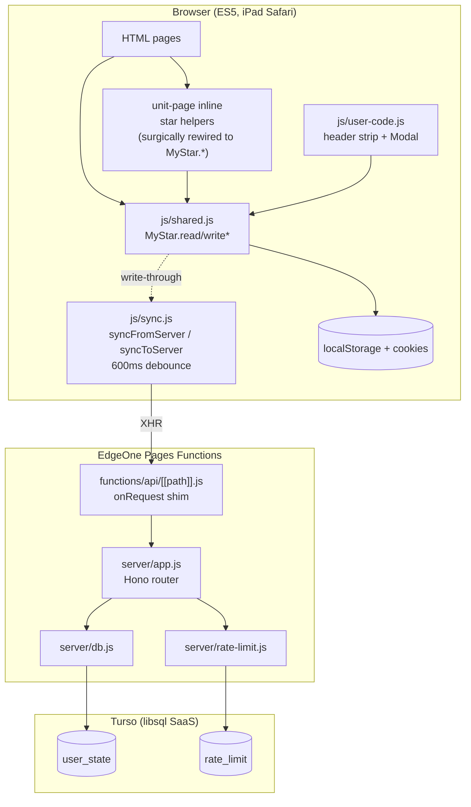
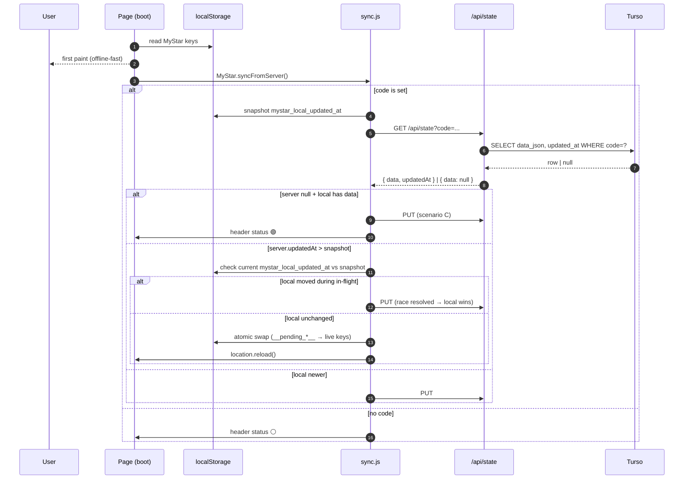
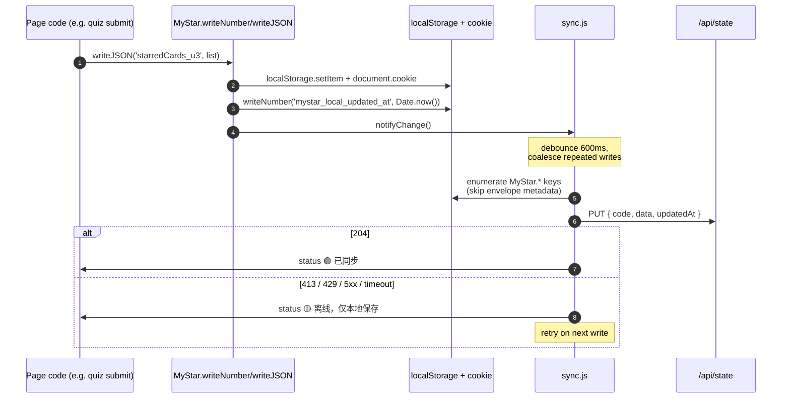

# Design Document

## Overview

server-user-state introduces a **thin server-side persistence layer** for star-app's user state — quiz scores, starred cards, active days — so that progress survives both the prod-URL-changes-per-deploy quirk of EdgeOne Pages and any future domain change. The architecture is deliberately small:

- **Frontend stays ES5**, iPad-Safari-compatible, offline-first. `localStorage` + cookies remain the source of truth at runtime; the server is an "occasionally-replicated" mirror.
- **Backend is a single Hono app** running as an EdgeOne Pages Function. Three routes: `GET /api/state`, `PUT /api/state`, `DELETE /api/state`, plus `GET /api/health`.
- **Storage is Turso (libsql)** — a managed SQLite SaaS reached over HTTPS. No persistent disk on the deploy platform; no DB file in git.
- **Identity is a user-typed short code (6–16 chars)**. No accounts, no PINs (v1 explicitly accepts this threat model per Requirement 1 #3).
- **Sync is a debounced whole-blob PUT** of every MyStar-prefixed `localStorage` key, minus envelope metadata. On page load the client races a `GET` against its first paint and `location.reload()`s if the server is newer.

The design also retires a real defect the user surfaced during requirements review: the inline `getStarredCards / saveStarredCards` helpers in `units/**/index.html` write `localStorage` + cookie directly, bypassing `MyStar.writeJSON` and therefore the sync layer. The fix is a **surgical 4-line edit per unit file**: replace the two helper bodies with thin `MyStar.readJSON / writeJSON` wrappers. The rest of the unit's inline `<script>` (blank toggles, `toggleCard`, `toggleAll`, sort, the inline `addTapListener`) stays UNTOUCHED — see "Unit-page surgical edits" below for the exact diff. No new shared JS file is introduced for star handling.

Every change is additive on the frontend public API; per-card-quiz-submit (just shipped) needs zero code changes.

## Steering Document Alignment

### Technical Standards (tech.md) — what changes, what doesn't

**Frontend constraints unchanged** (verbatim):
- ES5 only — `var`, `function`, no `const/let/arrow/template-literal/Promise/ES-modules`.
- Storage exclusively through `MyStar.readJSON / writeJSON / readNumber / writeNumber`.
- Tap interactions via `MyStar.addTapListener`.
- No fetch (for new code; pre-existing `review/index.html:180` fetch is grandfathered per R8#2).

**New "Backend (optional layer)" Stack section added to tech.md** — this is the steering update:
- Node 24.5.0 (matches EdgeOne configured runtime).
- Hono ^4.x as the HTTP router. Runs inside an EdgeOne Pages Function entry, single catch-all `functions/api/[[path]].js`.
- `@libsql/client` ^0.14.x (the `@libsql/client/web` flavor — Workers-compatible fetch transport, no Node-only APIs).
- One migration runner script (`scripts/migrate.mjs`) executed from the `npm run build` step. Idempotent, uses `PRAGMA table_info` to skip already-applied `ALTER TABLE ADD COLUMN`.
- ESM (`"type": "module"`) **only** for server code (anything outside `js/`). Frontend `js/*.js` stays ES5 IIFE.
- No additional dependencies. The dep budget for this layer is exactly two: `hono`, `@libsql/client`.

### Project Structure (structure.md) — additions

```
star-app/
├── functions/                     # NEW — EdgeOne Pages Functions root
│   └── api/
│       └── [[path]].js            # catch-all → Hono router
├── server/                        # NEW — shared backend code
│   ├── app.js                     # Hono app definition (route handlers)
│   ├── db.js                      # Turso client factory (per-request)
│   ├── rate-limit.js              # 30 PUT/min/IP via Turso table
│   └── validators.js              # code regex, payload bounds
├── migrations/                    # NEW — SQL migrations, git-tracked
│   ├── 001_init.sql
│   └── 002_rate_limit.sql
├── scripts/                       # NEW
│   └── migrate.mjs                # migration runner — runs on `npm run build`
├── js/
│   ├── shared.js                  # MODIFIED — cookie-double-write for writeNumber, mystar_local_updated_at writer, unknown-prefix warn
│   ├── sync.js                    # NEW — MyStar.syncFromServer / syncToServer / getSyncStatus / setUserCode / getUserCode / clearUserCode
│   └── user-code.js               # NEW — top header strip + identity prompt + 切换 + 清除云端进度
│                                  # (star handling stays inline in unit pages — see "Unit-page surgical edits")
├── style/
│   ├── shared.css                 # MODIFIED — header strip + status indicator + Modal styles
│   └── unit-enhance.css           # unchanged
├── index.html                     # MODIFIED — load user-code.js + sync.js; trigger syncFromServer at boot
├── review/index.html              # MODIFIED — load user-code.js + sync.js for the header strip + initial syncFromServer pull. The review page itself contains no `MyStar.write*` calls, so no debounced PUTs originate from user interaction here; however, the initial `syncFromServer` MAY itself PUT if the local snapshot is newer than the server (Sequence A scenario C / B-local-wins). (The pre-existing fetch at line 180 is grandfathered per R8#2.)
├── units/book1/u3/index.html      # MODIFIED — surgical: replace getStarredCards/saveStarredCards bodies only (4-line diff)
├── units/book1/u6/index.html      # MODIFIED — same as u3
├── package.json                   # NEW
├── .env.example                   # NEW — TURSO_DATABASE_URL, TURSO_AUTH_TOKEN
└── .gitignore                     # MODIFIED — add .env, node_modules/
```

New `structure.md` rules:
- **Backend code lives under `server/` and `functions/`.** `functions/api/[[path]].js` is intentionally a thin shim that imports `server/app.js` — this lets the same Hono app be testable in isolation outside the EdgeOne runtime.
- **Migrations live in `migrations/`, numbered `NNN_purpose.sql`.** Never edit a committed migration; add a new file.
- **`server/` is allowed to use modern ESM and Node 24 features.** `js/` is not.

### Conventions Compliance (colors.md)

- Header strip status indicator uses existing tokens: `--accent-green` (synced), `--accent-amber` (offline), `--neutral-gray` (no code).
- Conflict Modal uses `--accent-navy` primary CTA, `--ink` text, `--bg-color` card, `var(--shadow-md)` for paper-journal look (homepage convention).
- No new hex; no `border-left` decoration.

## Code Reuse Analysis

### Existing Components to Leverage

- **`MyStar.readJSON / writeJSON`** (`js/shared.js:8, 20`) — the existing localStorage + cookie double-write. `writeNumber / readNumber` will be **extended in-place** to mirror this pattern (Requirement 8 #3).
- **`MyStar.addTapListener`** (`js/shared.js:60`) — used as-is for the new identity prompt and Modal buttons. Star buttons continue to use the unit page's own inline `addTapListener` (unchanged).
- **`MyStar.isAnswerCorrect / timeAgo / recordActiveDay / getActiveDays / getStreak / isSameLocalDay`** — unchanged. No design impact.
- **The existing `mystar_active_days` JSON array** flows through Requirement 2's whole-blob sync unmodified.
- **Existing CSS tokens in `style/shared.css :root`** — every new style references these (no new hex).

### Integration Points

- **`shared.js` writeNumber / readNumber** — internal extension. Public signature unchanged.
- **Page boot — script include positions (per-file specifics):**
  - **`index.html` + `review/index.html`** — these files have their inline boot OR no boot at all and currently load external scripts at the bottom. Add `js/sync.js` and `js/user-code.js` immediately AFTER `js/shared.js` in the bottom block. Resulting include order: `shared.js → sync.js → user-code.js → (any page-inline `<script>` block)`. Any page-inline DCL handler that calls `MyStar.syncFromServer(...)` will see all three modules already loaded by the time DCL fires.
  - **`units/book1/u3/index.html` + `units/book1/u6/index.html`** — these files **already** have a large inline `<script>` block (u3 line 979+, u6 line 1248+) that comes BEFORE the external `shared.js` / `unit-enhance.js` includes (at u3 line 1167+). This works today because all MyStar calls inside the inline block are deferred to a DCL handler — by the time DCL fires, every external script has parsed and `MyStar.*` is fully populated. **Do NOT move the inline block.** Just add `js/sync.js` and `js/user-code.js` AFTER `js/unit-enhance.js` in the existing bottom block. Final HTML order: `<inline script with star/blank/toggle defs and DCL handler> ... <script src="../../../js/shared.js"> ... <script src=".../unit-enhance.js"> ... <script src=".../sync.js"> ... <script src=".../user-code.js">`. The inline DCL handler's registration order means it fires FIRST (before sync.js / user-code.js DCL handlers), so the inline block must not depend on `MyStar.getUserCode()` etc. — and it doesn't; only the star/blank/toggle logic runs there, all of which see `MyStar.readJSON / writeJSON / addTapListener` as already-defined by the time DCL fires.
  - The conceptual ordering "`shared.js → sync.js → user-code.js → page boot`" is about DCL **execution order**, not HTML parse order. Both unit pages naturally satisfy it because their inline DCL handler does NOT call sync.js's APIs — it only uses pre-existing MyStar APIs from shared.js. The new identity-prompt header strip is rendered by user-code.js's own DCL handler, which fires AFTER the inline block's DCL handler.
  - **The `MyStar.syncFromServer(...)` trigger MUST live in a brand-new inline `<script>` placed AFTER the `user-code.js` include, NOT inside the unit pages' existing inline block.** Reason: a DCL handler registered inside the existing inline block (which is parsed at line 979) registers earlier than `user-code.js`'s DCL handler (which is parsed at the bottom). DCL handlers fire in registration order → if syncFromServer were registered in the existing inline block, it would fire BEFORE user-code.js had a chance to render the header strip + status indicator, so the very first sync state update would have nowhere to display. The new trigger therefore lives in a small NEW inline tail script appended after all external includes:
    ```html
    <!-- existing tail of unit page -->
    <script src="../../../js/shared.js"></script>
    <script src="../../../js/unit-enhance.js"></script>
    <!-- NEW: -->
    <script src="../../../js/sync.js"></script>
    <script src="../../../js/user-code.js"></script>
    <script>
        document.addEventListener('DOMContentLoaded', function () {
            MyStar.syncFromServer(function () { /* no-op; UI updates flow through user-code.js */ });
        });
    </script>
    ```
    For `index.html`, the same pattern: the existing `M.recordActiveDay()` inline call already runs first (which is fine; it's a silent write now), THEN at the bottom append the same new `<script>` block calling `syncFromServer`. For `review/index.html`, append the same new `<script>` block.
- **Inline `getStarredCards / saveStarredCards` in `units/book1/u3/index.html` and `units/book1/u6/index.html`** — bodies SURGICALLY replaced with `MyStar.readJSON / writeJSON` calls (4-line diff per file). Everything else in those inline `<script>` blocks stays.
- **No integration with `nodejs-sqlite-migration`** — that spec is marked DEFERRED (`spec-workflow/specs/nodejs-sqlite-migration/STATUS.md`).
- **No integration with per-card-quiz-submit** — its keys (`quizScore_<slug>_<cardId>`) flow through R2's prefix rule automatically.

## Architecture



### Sequence A — Page load → GET state → apply



### Sequence B — Write → debounce → PUT



### Sequence C — Scenario D (code switch with two-sided data)

```mermaid
sequenceDiagram
    autonumber
    participant U as User
    participant UC as user-code.js
    participant Sy as sync.js
    participant LS as localStorage
    participant API as /api/state

    U->>UC: types code "alice", taps 开始
    UC->>Sy: probeIdentity('alice')
    Sy->>API: GET /api/state?code=alice
    API-->>Sy: { data: nonEmpty, updatedAt }
    Sy->>LS: hasLocalUserState() — see predicate below
    alt local empty
        Sy->>UC: → scenario A: pull and apply (silent)
    else local non-empty
        Sy->>UC: → scenario D: SHOW MODAL
        UC->>UC: render Modal<br/>(local + cloud summaries N张星标 K个unit)
        U->>UC: chooses one of:
        alt 用云端覆盖本地
            UC->>LS: atomic swap to cloud blob
            UC->>U: location.reload()
        else 用本地覆盖云端
            UC->>Sy: PUT local with updatedAt=Date.now()
            UC->>U: header status 🟢
        else 取消
            UC->>UC: discard typed code; back to prompt
        end
    end
```

## Components and Interfaces

All frontend components live inside their own IIFE module file. Server components are ESM.

### Frontend: `js/shared.js` (modified)

- **Purpose:** Same as today (storage + tap + time + active-day helpers), with three extensions.
- **Changes:**
  - `writeJSON(key, value)` / `writeNumber(key, value)` — existing localStorage + cookie behavior preserved. After the writes, call `_warnIfUnknownPrefix(key)` once per (key, page-load), then `_touchLocalUpdatedAt()` (which silently sets `localStorage.setItem('mystar_local_updated_at', String(Date.now()))` + cookie, and then calls `MyStar.__notifyChange` if defined: `if (MyStar.__notifyChange) { MyStar.__notifyChange(); }`).
  - `writeNumber(key, value)` — extend to also write a matching cookie **conditionally**: cookie is written for unit-level / global keys (`mystar_*`, `lastVisit_*`, `quizScore_<slug>` with no further underscore, `quizTime_*`) but NOT for per-card score keys (`quizScore_<slug>_<cardId>`). See "Cookie budget" risk and the denylist rationale below. Number values are written as `String(value)`; `readNumber` first reads localStorage, falls back to cookie via `decodeURIComponent`, parses via `Number()` and returns `null` on NaN.
  - `readNumber(key)` — add cookie fallback symmetric to `readJSON`'s read path (decode then `Number()`).
  - **`writeJSONSilent(key, value)` / `writeNumberSilent(key, value)`** — NEW. Same localStorage + cookie double-write as their non-silent siblings, but:
    1. Do NOT call `_touchLocalUpdatedAt()` — local clock unchanged.
    2. Do NOT call `MyStar.__notifyChange` — no debounce scheduling.
    3. Do call `_warnIfUnknownPrefix` (the warning is about key naming hygiene, not sync timing).
    Rationale: housekeeping writes that fire on `DOMContentLoaded` (recordActiveDay, lastVisit) MUST NOT bump the local clock — otherwise the very-first page-load write would mark local as "newer than server" and Sequence A's local-wins branch would PUT an effectively-empty boot blob over a rich cloud blob (real data loss). See C-1 in the "Boot-time race" subsection below.
  - **Call-site changes (NOT a refactor, just a one-line swap each):**
    1. `shared.js:121` — `recordActiveDay` internal write changes from `writeJSON('mystar_active_days', out)` to `writeJSONSilent('mystar_active_days', out)`.
    2. `unit-enhance.js:290` — `M.writeNumber(KEY_LAST, Date.now())` changes to `M.writeNumberSilent(KEY_LAST, Date.now())`.
  - **Post-initial-sync housekeeping flush (I-1 fix):** silent boot writes update localStorage but do NOT trigger a PUT. If the initial `syncFromServer` resolves WITHOUT a PUT (e.g. local clock == server clock, so neither side is "newer"), the silent housekeeping writes would never reach the server in that session — `mystar_active_days` for today, refreshed `lastVisit_<slug>` would lag until the next user-initiated write. To prevent that lag, `syncFromServer` SHALL end every non-reload resolution branch with a single deliberate flush:
    1. Set `mystar_local_updated_at` to `Date.now()` via raw `localStorage.setItem` **AND** matching cookie write (`document.cookie = 'mystar_local_updated_at=' + Date.now() + ';expires=...;path=/'`) — the clock has cookie fallback for iPad private-mode resilience just like everywhere else in this design (C-2). Do NOT call `_touchLocalUpdatedAt` (which would re-enter via notify).
    2. Schedule a debounced PUT through `MyStar.syncToServer()`.
    Branches that reach this flush: scenario A (silent pull complete), scenario B-no-change (clocks tied, no DOM mutation), scenario C (already PUT; the explicit flush is harmless), scenario D resolution. Branches that SKIP the flush: server-wins-overwrite branch (we `location.reload()` before reaching this line; on reload the new page's boot writes will themselves trigger the next flush). This guarantees `mystar_active_days` reaches the server even for "user just opened the homepage and closed" sessions, and that the clock survives private-mode localStorage failures.
  - `_warnIfUnknownPrefix(key)` — module-private. Allowed prefixes (verbatim): `mystar_`, `quizScore_`, `quizTime_`, `lastVisit_`, `starredCards_`. Unknown keys: `console.warn('[MyStar] key "X" does not match any documented sync prefix; it will not be synced to cloud.')` once per (key, page-load).
  - `_touchLocalUpdatedAt()` — writes `localStorage.setItem('mystar_local_updated_at', String(Date.now()))` AND a matching cookie (per C-2: the clock itself needs cookie fallback for iPad private mode where localStorage may fail). Exported on `MyStar` as `MyStar.touchLocalUpdatedAt` so that `sync.js` can also bump it after a server-overwrite apply (but per the silent-write rule there, `_atomicApplyServerBlob` does NOT call `touchLocalUpdatedAt` — it sets the value directly to the server's timestamp).
  - **ES5 notation reminder:** any "optional method" calls in the design like `MyStar.__notifyChange?.()` are pseudocode; in actual code use `if (MyStar.__notifyChange) { MyStar.__notifyChange(); }`. Optional chaining is ES2020 and forbidden under R8#1.

#### Boot-time race (C-1) — the data-loss path the silent variants prevent

Without the silent variants, the following sequence happens on EVERY homepage load (since `index.html:302` unconditionally calls `M.recordActiveDay()`):

1. `DOMContentLoaded` fires. `M.recordActiveDay()` runs and writes `mystar_active_days` via `writeJSON`. With normal `writeJSON`, this bumps `mystar_local_updated_at = Date.now()` and schedules a 600ms debounced PUT.
2. Page boot also calls `MyStar.syncFromServer()` which fires `GET /api/state?code=…` with snapshot `localUpdatedAt = Date.now()` (the value just written by step 1).
3. Server returns cloud blob with `updatedAt` from the previous session (older than step 1's just-written timestamp).
4. Sequence A's compare logic: local newer → schedule a PUT of the current localStorage. But localStorage at this moment is the FRESHLY-BOOTED localStorage, which on a new origin = nearly empty (only `mystar_active_days` and a stub `lastVisit_*`). The PUT overwrites the cloud's rich blob with this near-empty blob. **Real data loss.**

The silent variants close this hole by ensuring boot-time housekeeping writes don't move the local clock. The clock only moves on USER-initiated writes (star toggle, quiz submit, etc.), which is the correct semantics for "local is newer than the cloud snapshot".

Unit page `DOMContentLoaded` has the same risk via `M.writeNumber(KEY_LAST, ...)` — same fix.
- **Reuses:** Existing `writeJSON / readJSON` cookie-write code is the pattern to mirror.

### Frontend: `js/sync.js` (NEW)

- **Purpose:** Sync engine. Public additions to `MyStar.*`.
- **Public API:**
  - `MyStar.setUserCode(code)` — **silent write**. Sets cookie + localStorage entry directly via raw `document.cookie =` and `localStorage.setItem`, NOT via `MyStar.writeJSON`. Does NOT call `_warnIfUnknownPrefix`, does NOT call `_touchLocalUpdatedAt`, does NOT trigger any debounce. Rationale: identity changes happen during the Scenario-D probe — if `setUserCode` debounced a PUT, the current local blob could be uploaded to a freshly-typed code BEFORE the user decides cloud-wins / local-wins / cancel.
  - `MyStar.getUserCode()` — read order: cookie → localStorage. Returns `null` if absent or invalid.
  - `MyStar.clearUserCode()` — silent write: clears cookie + localStorage entry; does **not** clear other MyStar keys; does **not** trigger sync.
  - `MyStar.syncFromServer(callback)` — performs Sequence A; calls `callback(err, applied)` where `applied` is `true` if `location.reload()` is about to fire (so caller doesn't render).
  - `MyStar.syncToServer()` — schedules a debounced PUT.
  - `MyStar.getSyncStatus()` → `{ state: 'synced' | 'offline' | 'disabled', lastSyncAt: number | null, lastError: string | null }`.
  - `MyStar.flushPendingSync()` — best-effort immediate PUT for `visibilitychange`/`beforeunload`.
- **Internals:**
  - `_collectStateBlob()` — enumerates keys matching documented prefixes from BOTH `localStorage` AND `document.cookie`, excludes `mystar_user_code` + `mystar_local_updated_at`, returns `{ [key]: rawStringValue }`.
    **Encoding contract (C-2):**
    - localStorage values are stored as raw strings already (e.g. `'[\"vocab-card-1\"]'` for JSON, `'85'` for number). Read with `localStorage.getItem(k)` and store in the blob as-is.
    - Cookie values are stored `encodeURIComponent`-encoded (per `writeJSON` at `shared.js:25`). The cookie pass MUST `decodeURIComponent(match[1])` before placing the value in the blob, so cookie-sourced and localStorage-sourced entries share the same string format. Without decode, the server would store URL-encoded strings and the apply step would `JSON.parse` them and fail.
    - Algorithm:
      ```js
      // pseudocode
      var keys = {};   // dedup
      var blob = {};
      var prefixes = ['mystar_', 'quizScore_', 'quizTime_', 'lastVisit_', 'starredCards_'];
      var exclude = { 'mystar_user_code': 1, 'mystar_local_updated_at': 1 };
      // localStorage pass
      for (i = 0; i < localStorage.length; i++) {
          var k = localStorage.key(i);
          if (exclude[k]) continue;
          if (matchesPrefix(k, prefixes)) {
              blob[k] = localStorage.getItem(k);   // raw string
              keys[k] = 1;
          }
      }
      // cookie pass (decode + only if not seen in LS)
      var pairs = document.cookie.split(/;\s*/);
      for (i = 0; i < pairs.length; i++) {
          var eq = pairs[i].indexOf('=');
          if (eq < 0) continue;
          var k = pairs[i].substring(0, eq);
          if (exclude[k] || keys[k]) continue;
          if (matchesPrefix(k, prefixes)) {
              blob[k] = decodeURIComponent(pairs[i].substring(eq + 1));
              keys[k] = 1;
          }
      }
      return { blob: blob, allKeys: keys };  // allKeys reused by the apply step
      ```
    - Returns both the blob and the set of all observed keys (LS ∪ cookies), because `_atomicApplyServerBlob` needs that set to know which keys to DELETE on a server-wins apply (see below). Returning only the blob would lose cookie-only stale keys.
  - `_hasLocalUserState()` — returns `true` iff `_collectStateBlob()` has at least one key with a non-empty string value (`'""'` and `'[]'` both count as empty since they have no user content; `'"value"'` and `'[1,2]'` do not). Concrete predicate: `for each k in _collectStateBlob() if v && v !== '0' && v !== '""' && v !== '[]' && v !== '{}' return true; return false;`. This is the gate between Scenario A (false → silent pull) and Scenario D (true → Modal).
  - `_atomicApplyServerBlob(blob, serverUpdatedAt)` — Requirement 5 #7's swap algorithm. **Critical correctness rules:**
    1. **Use raw `localStorage.setItem(k, v)` + matching cookie write — NOT `MyStar.writeJSON(k, v)`.** writeJSON would `JSON.stringify` an already-encoded JSON string, double-encoding the value.
    2. **Set `mystar_local_updated_at = serverUpdatedAt` SILENTLY** (raw localStorage.setItem, no notify, no debounce). Do NOT call `MyStar.touchLocalUpdatedAt()` — that would set the clock to `Date.now()` and trigger a `_notifyChange()`, causing a feedback loop where the just-pulled cloud blob immediately gets PUT back to the server stamped with a newer time.
    3. **localStorage has NO transactions** — this routine is **best-effort sequential**, not truly atomic. The "atomic" wording in R5#7 is honoring user intent; concretely we minimize the failure window by completing the swap synchronously before any DOM operation, and an error toast on partial failure surfaces the inconsistency for manual recovery (clear site data + re-pull).

    Sequential algorithm (synchronous, no `setTimeout`). Cookie writes use `encodeURIComponent` (mirroring `writeJSON` at `shared.js:25`); cookie deletes use `document.cookie = k + '=; expires=Thu, 01 Jan 1970 00:00:00 GMT; path=/'`.
    1. Call `_collectStateBlob()` to get `currentKeys = LS ∪ cookies` (the union — critical, otherwise cookie-only stale keys survive the swap; see C-2).
    2. For each entry in the new server blob, write a temp key `__pending_<orig-key>__` to localStorage AND `document.cookie = '__pending_<orig-key>__=' + encodeURIComponent(value) + ';...'`. Skip the two envelope-metadata keys.
    3. For each key `k` in `currentKeys` that is NOT in the new blob and NOT envelope-metadata: `localStorage.removeItem(k)` + cookie-delete `k`. This now correctly catches cookie-only stale keys (the C-2 fix).
    4. For each pending key: `localStorage.setItem(origKey, value)` + `document.cookie = origKey + '=' + encodeURIComponent(value) + ';...'`; then `localStorage.removeItem('__pending_<origKey>__')` and cookie-delete the pending cookie name.
    5. Silent write: `localStorage.setItem('mystar_local_updated_at', String(serverUpdatedAt))` AND matching cookie write. **No `MyStar.touchLocalUpdatedAt()` call here** — that would call `_notifyChange` and re-trigger the feedback loop the silent write is designed to prevent.
    6. Caller (`syncFromServer`) immediately invokes `location.reload()` — no DOM read happens between apply and reload, so the user never observes a half-swapped state.

    On any exception mid-loop, abort and surface an error toast `"同步出错，建议重新进入页面"`. Live keys are not guaranteed untouched (acknowledged best-effort downgrade from R5#7); the orphan `__pending_*__` keys remain harmless (excluded from `_collectStateBlob`).
  - `_xhr(method, url, body)` — small XHR wrapper returning `(err, statusCode, parsedJson)`. 8 s timeout.
  - `_scheduleDebounce()` — single timer at module scope; 600 ms.
- **Dependencies:** `MyStar.readJSON / writeJSON / readNumber / writeNumber / addTapListener` from shared.js.

### Frontend: `js/user-code.js` (NEW)

- **Purpose:** Identity UI — header strip, prompt, "切换", "清除云端进度", Modal for Scenario D.
- **Components:**
  - `_renderHeaderStrip()` — injects `<div class="mystar-userbar">` at top of `body`. Three layouts driven by `getUserCode()`:
    1. No code → `[输入学习账号 ____] [开始]`
    2. Code set → `你好，<code> · 切换 · 清除云端进度 · 状态点(🟢/🟡/⚪)`
  - `_renderModal(local, cloud)` — Scenario D Modal. Fixed-position overlay, but uses `position: fixed` + `overflow: hidden` on `body` (NOT `html`) — iPad Safari has known issues with fixed-on-body scroll lock, mitigated by also setting `touch-action: none` on the overlay.
  - `_computeSummary(blob)` — returns `'约 N 张星标 · K 个 unit 有成绩'` per R5#4 formula: N = `Σ JSON.parse(blob['starredCards_*']).length`; K = `count of keys matching /^quizScore_[^_]+$/ where Number(value) > 0`.
- **Reuses:** `MyStar.addTapListener` for all buttons; existing CSS tokens.

### Unit-page surgical edits (NOT a new shared file)

**Plan change:** the original draft proposed a new `js/star-controls.js`. After verifying the actual unit-page code, this is dropped. The unit `<script>` block contains FAR more than star handling: it defines `toggleCard`, `toggleAll`, blank-toggle wiring, sort logic, an inline `addTapListener`, and the global "显示全部答案" button — all sharing local state. Deleting the whole block would cascade-break unrelated behavior. Stored card IDs are also the **full DOM id** (e.g. `["vocab-card-1", "vocab-card-3"]`), not bare numbers, confirmed by `card.id` being passed to `toggleStar()` and used directly as `document.getElementById(id)` on restore.

**Surgical fix (per unit page):** replace ONLY the bodies of the two storage helpers, leaving the rest of the inline script untouched.

In `units/book1/u3/index.html` (current lines ~980–1004):
```js
// Before:
function getStarredCards() {
    try {
        var val = localStorage.getItem('starredCards_u3');
        if (val) return JSON.parse(val);
    } catch (e) {}
    // ... cookie fallback ...
    return [];
}
function saveStarredCards(cards) {
    var val = JSON.stringify(cards);
    try { localStorage.setItem('starredCards_u3', val); } catch (e) {}
    // ... cookie write ...
}

// After:
function getStarredCards() {
    return MyStar.readJSON('starredCards_u3') || [];
}
function saveStarredCards(cards) {
    MyStar.writeJSON('starredCards_u3', cards);
}
```

Same surgical change in `units/book1/u6/index.html` (current lines ~1249–1270), substituting `u6` for the slug literal.

**Net effect:** star toggles now flow through `MyStar.writeJSON`, which triggers the sync chain. Card IDs continue to be stored as full `"vocab-card-N"` strings — no change to the payload schema or DOM lookup. The inline `addTapListener`, `toggleCard`, `toggleAll`, blank-toggle, sort, and globalBtn wiring remain UNTOUCHED.

**Confirmed line refs:**
- `units/book1/u3/index.html` — inline storage helpers at lines 980–1004; full inline `<script>` block continues to ~line 1170+.
- `units/book1/u6/index.html` — inline storage helpers at lines 1249–~1270.

### Backend: `functions/api/[[path]].js` (NEW)

- **Purpose:** EdgeOne Pages Functions entry shim. Catches all `/api/*` routes and hands them to Hono.
- **Body (sketch):**
  ```js
  // ESM. Runs in EdgeOne's Workers-like runtime.
  import app from '../../server/app.js';
  // Hono's fetch signature is (request, env, executionCtx).
  // context.env holds TURSO_DATABASE_URL / TURSO_AUTH_TOKEN; passing it as the
  // second arg makes them reachable via c.env.TURSO_DATABASE_URL in handlers.
  export const onRequest = (context) =>
      app.fetch(context.request, context.env, context);
  ```
- **Notes:** The handler entry name (`onRequest` vs `onRequestGet/Put/Delete`) is EdgeOne-specific and matches Cloudflare Pages conventions; verify at first deploy. If EdgeOne uses a slightly different shape (e.g. `export default { fetch }`), only this file changes; `server/app.js` is portable.

### Backend: `server/app.js` (NEW)

- **Purpose:** All HTTP routes in one Hono app.
- **Routes:**
  - `GET /api/health` → `200 { ok: true }`.
  - `GET /api/state?code=…` → 200 `{ data: <object> | null, updatedAt: <number> | null }` or 400 (bad code).
  - `PUT /api/state` body `{ code, data, updatedAt }` → 204; 400 / 413 / 429; never 500 on rate-limit (use 429).
  - `DELETE /api/state` body `{ code }` → 204 (idempotent; same response on delete and no-op per R9#3).
- **Middleware order:**
  1. CORS (allow same-origin only; the static and API are same-origin under EdgeOne Pages).
  2. Validator (code regex; payload size header check for PUT).
  3. Rate-limit (PUT only).
  4. Route handler (DB call).
- **Errors:** Returned as Hono `c.json({ error: 'reason' }, status)`. No stack traces in body.
- **Logging:** `console.log(JSON.stringify({ ts, ip, code, method, bytes, status, latency_ms }))` per R10#3. `ip` from `c.req.header('CF-Connecting-IP') || c.req.header('X-Real-IP') || c.req.header('X-Forwarded-For')` (EdgeOne propagates similar headers; pick the first non-empty).

### Backend: `server/db.js` (NEW)

- **Purpose:** Thin factory around `@libsql/client/web`. **Per-request** client (Pages Functions are stateless; do not keep a long-lived connection).
- **API:**
  ```js
  export function getDb(env) {
      return createClient({
          url: env.TURSO_DATABASE_URL,
          authToken: env.TURSO_AUTH_TOKEN,
      });
  }
  ```
- **Notes:** No connection pool; libsql HTTP transport handles this internally.

### Backend: `server/rate-limit.js` (NEW)

- **Purpose:** Implement R10#2's per-IP write rate limit using a Turso table.
- **API:** `async function checkAndIncrement(db, ip): { allowed: boolean, count: number, resetInSeconds: number }`.
- **SQL (single round trip when possible):**
  ```sql
  INSERT INTO rate_limit (ip, window_minute, count)
  VALUES (?, ?, 1)
  ON CONFLICT(ip, window_minute) DO UPDATE SET count = count + 1
  RETURNING count;
  ```
  Compute `window_minute = Math.floor(Date.now() / 60000)`.
- **GC:** One-in-50 requests issue `DELETE FROM rate_limit WHERE window_minute < ?` for windows older than current - 1.
- **Return:** `allowed = count <= 30`. On disallowed → response 429 with `Retry-After: <seconds-until-next-window>`.

### Backend: `server/validators.js` (NEW)

- `validateCode(code)` — regex `/^[a-zA-Z0-9_\-]{6,16}$/`. Returns boolean.
- `validatePayloadBytes(rawBodyString)` — counts UTF-8 **bytes**, not characters: `new TextEncoder().encode(rawBodyString).byteLength <= 65536`. `String.prototype.length` returns UTF-16 code units (e.g. `'你'.length === 1` but it's 3 bytes in UTF-8) — wrong unit for "64 KB". Server reads the raw request text once via `c.req.text()`, checks length, then `JSON.parse` if under cap. Over-cap → 413 immediately.

### Migration runner: `scripts/migrate.mjs` (NEW)

- **Purpose:** Apply `migrations/NNN_*.sql` files in order against Turso. Idempotent.
- **Algorithm:**
  ```js
  // pseudocode
  for each file in sorted(migrations/*.sql):
      sql = read(file)
      statements = split(sql, ';') // naive split is enough; migrations are small + human-written
      for each statement:
          if statement matches /CREATE TABLE IF NOT EXISTS/:
              execute(statement)   // libsql handles this directly
          else if statement matches /ALTER TABLE (\w+) ADD COLUMN (\w+)/:
              // libsql does NOT support IF NOT EXISTS for ADD COLUMN
              info = await db.execute(`PRAGMA table_info(${table})`)
              if (column already in info.rows): skip
              else: execute(statement)
          else:
              execute(statement)
  ```
- **Entry:** `node scripts/migrate.mjs`. Reads env from `process.env` only — no `dotenv` (would be a third dep). For local dev: `TURSO_DATABASE_URL=... TURSO_AUTH_TOKEN=... node scripts/migrate.mjs`. For deploy: EdgeOne build step inherits configured env vars.
- **`npm run build`** invokes this. **Deploy prerequisite:** `TURSO_DATABASE_URL` and `TURSO_AUTH_TOKEN` MUST be configured as **build-time environment variables** in EdgeOne Pages (not just runtime — both are needed during `npm run build`). If absent, `migrate.mjs` SHALL fail fast with an exit code != 0, which fails the build. The deployment-setup task in tasks.md MUST include verifying these are configured at both build-time AND runtime before the first deploy.

### `package.json` script contract (I-2)

This is the canonical script table. requirements.md, design.md verification, and tasks.md all reference these names — no other npm script names appear in this spec.

```json
{
    "name": "star-app",
    "private": true,
    "type": "module",
    "engines": {
        "node": ">=24.0.0"
    },
    "scripts": {
        "migrate": "node scripts/migrate.mjs",
        "build":   "npm run migrate",
        "dev":     "node scripts/dev.mjs",
        "test":    "echo 'no test runner — verification is manual + Playwright in spec-test phase' && exit 0"
    },
    "dependencies": {
        "hono":           "^4.6.0",
        "@libsql/client": "^0.14.0"
    }
}
```

Exact versions confirmed at lockfile-creation time; the carets allow patch updates. **No devDependencies.** `scripts/dev.mjs` uses only stdlib (`http`, `fs`, `path`, `url`).

| Script | What it does | When it runs |
|---|---|---|
| `npm run migrate` | Apply `migrations/*.sql` against Turso, idempotent. Reads `TURSO_*` from `process.env`. Exits 1 on missing env. | Manually for local DB setup; called by `build`. |
| `npm run build` | Composite alias for `migrate`. The only build step in this project. | EdgeOne Pages build phase (configured in the "编译命令" field). |
| `npm run dev` | Starts a local Node + Hono server on port 8000, mounting `server/app.js` plus a static-file middleware so the existing HTML/CSS/JS works the same as on the deploy platform. Reads `.env` if present (via plain `fs.readFileSync` + parse — no dotenv dep). | Local development only. NOT used by EdgeOne. |
| `npm start` | **Intentionally NOT defined.** EdgeOne Pages auto-discovers `functions/` and runs the catch-all; there is no long-running Node process. |

**`scripts/dev.mjs`** is a new helper (~40 lines): reads `.env` (plain `fs.readFileSync` + parse, no dotenv dep), wraps `server/app.js`'s Hono `app.fetch` in a raw `http.createServer` handler that converts Node IncomingMessage → web Request and Response → Node res.write (~20 lines of glue), plus a tiny static-file fallback that serves `./` for any non-`/api/*` path. This script exists ONLY for local convenience and is **excluded from the deploy artifact**. The dependency budget stays at exactly two (`hono` + `@libsql/client`) — no `@hono/node-server` is added.
- **Fail-fast behavior:** at startup, `migrate.mjs` SHALL `process.exit(1)` with a clear error message if either env var is missing or empty — better than letting libsql produce a cryptic auth error later.

### Style: `style/shared.css` (modified — additions only)

- `.mystar-userbar` — fixed top strip; uses `--bg-color`, `--ink`, `--accent-navy` for input border + button.
- `.mystar-userbar__status` — inline-flex; dot + text.
- `.mystar-userbar__status[data-state="synced"] .dot` — `background: var(--accent-green);`
- `.mystar-userbar__status[data-state="offline"] .dot` — `background: var(--accent-amber);`
- `.mystar-userbar__status[data-state="disabled"] .dot` — `background: var(--neutral-gray);`
- **New token in `style/shared.css :root` and documented in `conventions/colors.md`:** `--overlay-tint: rgba(22, 58, 95, 0.55);` (the `--ink` color #163A5F with 0.55 alpha — a modal scrim that matches the homepage paper-journal idiom). This follows the same pattern as the existing `--shadow-md` token which is the ink color with offset (colors.md rule #6 permits soft variants of palette colors as composed values). Adding to `conventions/colors.md`'s token table is part of the steering update.
- `.mystar-modal-overlay` — `position: fixed; inset: 0; background: var(--overlay-tint); display: flex; align-items: center; justify-content: center; touch-action: none;`
- `.mystar-modal` — uses paper-journal idiom: `background: var(--card-bg); border: 2px solid var(--ink); box-shadow: var(--shadow-md); border-radius: 12px; padding: 20px 24px;`
- `.mystar-modal__cta--cloud-wins` — primary navy CTA.
- `.mystar-modal__cta--local-wins` — secondary green CTA.
- `.mystar-modal__cta--cancel` — text-link.
- No new hex values.

## Data Models

### Turso schema (`migrations/001_init.sql`)

```sql
-- 001_init.sql
CREATE TABLE IF NOT EXISTS user_state (
    code        TEXT PRIMARY KEY,
    data_json   TEXT NOT NULL,
    updated_at  INTEGER NOT NULL,
    bytes       INTEGER NOT NULL
);

CREATE INDEX IF NOT EXISTS idx_user_state_updated_at ON user_state (updated_at);
```

### Turso schema (`migrations/002_rate_limit.sql`)

```sql
-- 002_rate_limit.sql
CREATE TABLE IF NOT EXISTS rate_limit (
    ip             TEXT NOT NULL,
    window_minute  INTEGER NOT NULL,
    count          INTEGER NOT NULL,
    PRIMARY KEY (ip, window_minute)
);
```

Kept in a separate file from `user_state` so a future "drop rate-limit entirely" (e.g. if EdgeOne adds first-class WAF) is a single-file action.

### `data_json` payload contract

Top-level keys mirror `localStorage` keys (after envelope-metadata exclusion):

```jsonc
{
    "mystar_active_days": "[\"2026-05-27\",\"2026-05-28\",\"2026-06-01\"]",  // JSON-encoded string, same as localStorage
    "lastVisit_u3": "1780301970991",       // number-as-string (matches MyStar.writeNumber storage)
    "quizScore_u3": "85",
    "quizTime_u3": "1780301970991",
    "starredCards_u3": "[\"vocab-card-1\",\"vocab-card-3\",\"vocab-card-7\"]",
    "quizScore_u3_vocab-card-1": "100"     // per-card-quiz-submit, transparent
    // no mystar_user_code, no mystar_local_updated_at
}
```

**Important:** all values are **strings** as stored in localStorage. The client does NOT pre-parse them before sending; the server treats the whole object as opaque and stores `JSON.stringify(data)`. On apply, the client writes each value back via `localStorage.setItem(k, v)` — the natural string-in/string-out preserves round-trip fidelity.

The PUT request body:
```json
{ "code": "alice1", "data": { ...as above... }, "updatedAt": 1780301970991 }
```

## API Contract Summary

| Method | Path | Body / Query | Success | Failures |
|---|---|---|---|---|
| GET | `/api/health` | — | 200 `{ ok: true }` | — |
| GET | `/api/state?code=…` | query | 200 `{ data: object\|null, updatedAt: number\|null }` | 400 (bad code) |
| PUT | `/api/state` | `{ code, data, updatedAt }` | 204 | 400 (bad code / bad body) / 413 (> 64 KB) / 429 (`Retry-After`) |
| DELETE | `/api/state` | `{ code }` | 204 (idempotent) | 400 (bad code) |

Notes:
- All bodies are JSON. Content-Type `application/json`.
- 429 includes `Retry-After: <seconds>`.
- No 5xx is explicitly produced; an unhandled exception falls through to EdgeOne's default 500. Client treats any ≥ 500 like a 429 (transient).

## Error Handling

### Client-side error matrix

| Trigger | Surface | State change |
|---|---|---|
| GET timeout (> 8 s) | header status → 🟡 离线，仅本地保存 | no localStorage change |
| GET 5xx | same as timeout | no localStorage change |
| GET 400 | console.warn (this is our bug or a bad code on disk); header → 🟡 | no localStorage change |
| GET 200 + server.updatedAt newer | atomic swap + `location.reload()` (Sequence A path) | localStorage rewritten |
| GET 200 + null data | scenario C → PUT local | server now has the blob |
| PUT 204 | header → 🟢 已同步 · <relative time> | sync-status persisted in memory only (not in MyStar.*) |
| PUT 413 | header → 🟡 + persistent toast "云端拒绝：进度过大（> 64 KB）" | in-memory flag `_oversizeBlocked = true` in sync.js prevents further PUT scheduling until next page reload; debounce timer is cleared. localStorage continues to work normally. |
| PUT 429 | header → 🟡; honor `Retry-After` by skipping retries until the timestamp | next debounce after `Retry-After` will re-fire |
| PUT 5xx / timeout | header → 🟡; retry next write | no special state |
| DELETE 204 | header → 🟡 (until next PUT) | local data unchanged |
| Network unavailable (XHR error event) | header → 🟡; treat as 0-status | same as timeout |

### Server-side error scenarios

1. **Bad code format (any route)** → 400 `{ error: 'invalid code' }`.
2. **Bad JSON body (PUT/DELETE)** → 400 `{ error: 'malformed body' }`.
3. **Body exceeds 64 KB (PUT)** → 413 `{ error: 'payload too large' }`. Hono provides Content-Length when present; if absent, count bytes after `await c.req.text()`.
4. **Rate limit exceeded** → 429 with `Retry-After` header.
5. **Turso unreachable (network error inside fetch transport)** → propagate as 500 (default). EdgeOne logs the exception.
6. **Turso constraint violation (PK conflict on `user_state`)** — impossible under `INSERT ... ON CONFLICT DO UPDATE`, but if observed → 500.

## Steering Updates (carried by this spec)

The following steering edits ship as part of this feature (separate task in tasks.md, but mentioned here for completeness):

### `spec-workflow/steering/product.md` (I-1)

The current `product.md` non-goals section is in **direct conflict** with this feature:
- Line 20: "No accounts, no sync, no backend. All state is per-device in `localStorage` + cookie fallback."
- Line 21: "No build pipeline, no framework, no package manager. Stays a folder of static files."

These must be updated, otherwise future agents reading steering will rule this feature out-of-bounds. Proposed replacement text:

```md
## Non-goals

- **Pre-v1 product axis:** no accounts, no sync, no backend. (Superseded by server-user-state in 2026-06 — see below.)
- No build pipeline for the **frontend layer** — `js/` and `style/` stay file-served-as-is, ES5, no transpiler.
- No mobile/native apps. No public deployment beyond a single hobby host (currently EdgeOne Pages).

## Optional layers (added 2026-06)

- **Cloud sync via short code** — `server-user-state` adds an opt-in identity (typed short code) + Turso-backed
  mirror of `MyStar.*` state. The browser is still authoritative offline; the server is a replica that lets the
  same student carry progress across the prod-URL-changes-per-deploy quirk of the host platform. Frontend
  constraints are unchanged.
- **Backend layer (Node 24.5.0)** — see `tech.md` "Backend (optional layer)". Only the `server/`, `functions/`,
  `migrations/`, and `scripts/` directories use npm + ESM.
```

### `spec-workflow/steering/tech.md`

- **Stack** section — add subsection:
  ```
  ### Backend (optional layer, EdgeOne Pages Functions)
  - Node 24.5.0
  - Hono ^4.x
  - @libsql/client ^0.14.x (web flavor)
  - ESM (`"type": "module"` in package.json); applies to server/ and scripts/ only.
  - Two dependencies total. Adding a third requires updating this doc and a rationale.
  ```
- **Architectural decisions** — append:
  ```
  ### Server is a sync mirror, not a source of truth
  localStorage + cookie is the runtime source of truth; the server is an
  occasionally-replicated mirror. App MUST continue to work fully offline.
  ```
- **Known limitations** — append:
  ```
  - Turso outage → app stays usable but progress doesn't sync. Status indicator surfaces this.
  - Short-code identity is unprotected (R1 #3); product-level decision.
  ```

### `spec-workflow/steering/structure.md`

- **Directory layout** — add `functions/`, `server/`, `migrations/`, `scripts/`, `package.json`, `.env.example` rows.
- **Where things go** — append:
  ```
  - **A new backend route** → add to `server/app.js`.
  - **A new SQL migration** → new file `migrations/NNN_purpose.sql`; never edit a merged migration.
  - **A new piece of server logic shared between routes** → new file under `server/`.
  ```
- **Anti-patterns** — append:
  ```
  ❌ Long-lived global state in server/ (Pages Functions are ephemeral; create resources per-request).
  ❌ ESM/Node-specific imports in js/ (those files must stay ES5).
  ```

## Risks / Trade-offs

| # | Risk | Severity | Mitigation |
|---|---|---|---|
| 1 | Cookie size budget after writeNumber also writes cookies | Medium (mitigated by denylist) | The naïve "writeNumber double-writes cookie for every key" approach blows up the cookie header at scale. Recomputed worst case for the current content: u3 has ~32 cards × per-card `quizScore_<slug>_<cardId>` keys; u6 has ~33; total ~65 per-card score keys alone, EACH a separate cookie sent on every same-origin request. Adding 10 future units × ~35 cards = 350 keys, ~17 KB total cookie header — likely past Safari's per-request cap (~8 KB practical, varies). **Mitigation (built into writeNumber, not deferred):** writeNumber cookie double-write is **conditional via a denylist**: keys matching `/^quizScore_[^_]+_/` (per-card scores) skip the cookie write and live only in localStorage + server. Rationale: per-card scores are individually low-value (each one is recoverable from the unit aggregate `quizScore_<slug>`); a private-mode user without a code who loses them on browser close is no worse off than today. Keys still cookie-backed: `mystar_active_days`, `mystar_user_code`, `mystar_local_updated_at`, `lastVisit_<slug>`, `quizScore_<slug>` (unit aggregate), `quizTime_<slug>`, `starredCards_<slug>`. Total cookie inventory: ~6 per unit + 3 globals = ~15 cookies for current 2-unit content; ~33 cookies for a hypothetical 10-unit future — well under the 4 KB-per-cookie limit and the ~8 KB total-header limit. |
| 2 | `location.reload()` UX — loses scroll position and any in-flight UI | Low–Medium | Triggers ONLY on Scenario A or Scenario B-server-wins, which happen at most once per page load. Future improvement noted in R4#2 rationale. |
| 3 | rate_limit table contention | Low | One row per (ip, minute) — high write skew impossible. Turso handles single-row UPDATE concurrency. |
| 4 | Hono entry shape on EdgeOne differs from Cloudflare Pages | Low | If the export name or env access differs, only `functions/api/[[path]].js` changes; `server/app.js` is portable. Verify at first deploy. |
| 5 | iPad Safari Modal scroll lock | Low | Use `touch-action: none` on overlay + `overflow: hidden` on `body` (not `html`); known iPad bug only affects `html`. |
| 6 | Surgical helper replacement may miss one unit or typo the slug literal | Low | Both `units/book1/u3/index.html` (slug `u3`) and `units/book1/u6/index.html` (slug `u6`) require the same 4-line diff; the slug literal is hardcoded in each file. Verification: after the edit, manually star a card in u3 and u6 each, confirm the cloud `data_json` contains entries for both `starredCards_u3` and `starredCards_u6` with full `"vocab-card-N"` IDs. The unrelated inline behavior (blank toggles, sort, globalBtn) is exercised by the existing per-card-quiz-submit Playwright check — re-run it to confirm no regression. |
| 7 | Coordinator's enumeration misses keys written outside MyStar | Medium | Mitigated three ways: (a) R8#4 surgical edit pushes star writes through `MyStar.writeJSON`; (b) `_collectStateBlob` now also enumerates `document.cookie` so iPad private-mode falls are caught; (c) R2#3 `console.warn` flags any future feature picking a non-conforming key. |
| 8 | Migration runner naive `split(';')` breaks on multi-statement migrations with quoted semicolons | Low | Our migrations are simple CREATE/ALTER only. If complexity grows, switch to a real SQL parser. |
| 9 | Sync interferes with per-card-quiz-submit's existing 26-check Playwright matrix | Low | If no code is set, sync is dormant (R8#6); the existing test runs unaffected. New tests added for sync paths. |
| 10 | Identity Modal blocks the user if Scenario D presents but cloud GET fails | Medium | Modal renders only after successful GET (Scenario D requires *both* sides have data). On GET failure → fall back to Scenario A-or-C decision using local-only signal; document this in the sync.js Modal-trigger predicate. |

## Verification Plan (for the upcoming tasks phase)

End-to-end smoke checklist that the tasks must produce hooks for:

1. **Local dev:** `npm ci && npm run migrate && npm run dev` — `npm run dev` runs the `scripts/dev.mjs` shim (Hono `app.fetch` wrapped in raw `http.createServer`) on port 8000, plus static-file serving. Visit `http://localhost:8000` to exercise the full stack against the real Turso DB. No platform CLI required.
2. **Set a code, write some state, reload page** — header turns 🟢, data persists.
3. **Clear `localStorage` but keep cookie, reload** — server pull repopulates localStorage; `location.reload()` fires once.
4. **Open in fresh incognito window, type the same code** — Scenario A; data appears.
5. **Local edits + offline (disable network in DevTools), reload** — Scenario B retry path; no data loss.
6. **Switch to a different code that exists on server with both sides non-empty** — Modal appears; pick each option; verify atomicity.
7. **PUT 30+ times in a minute from one IP** — 31st returns 429 with `Retry-After`; client shows 🟡 and respects it.
8. **DELETE then GET same code** — GET returns `{ data: null }`.
9. **Deploy to EdgeOne, reach prod URL, repeat checks 2–6** — confirms the function entry shape works in the real runtime.
10. **iPad Safari (target device)** — manual verification of the header strip + Modal scroll lock.
